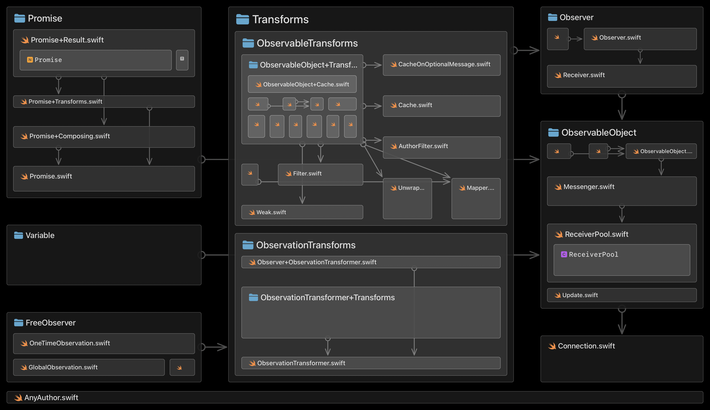
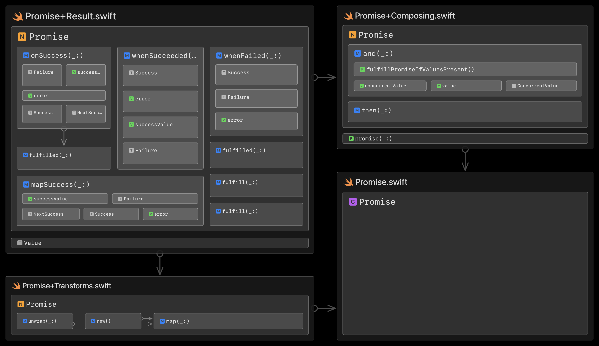
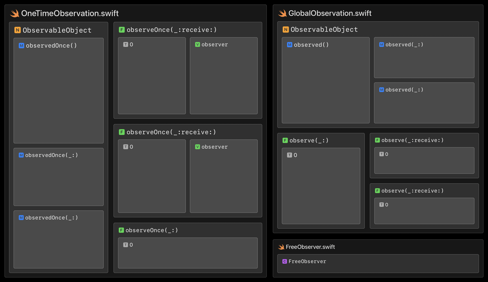
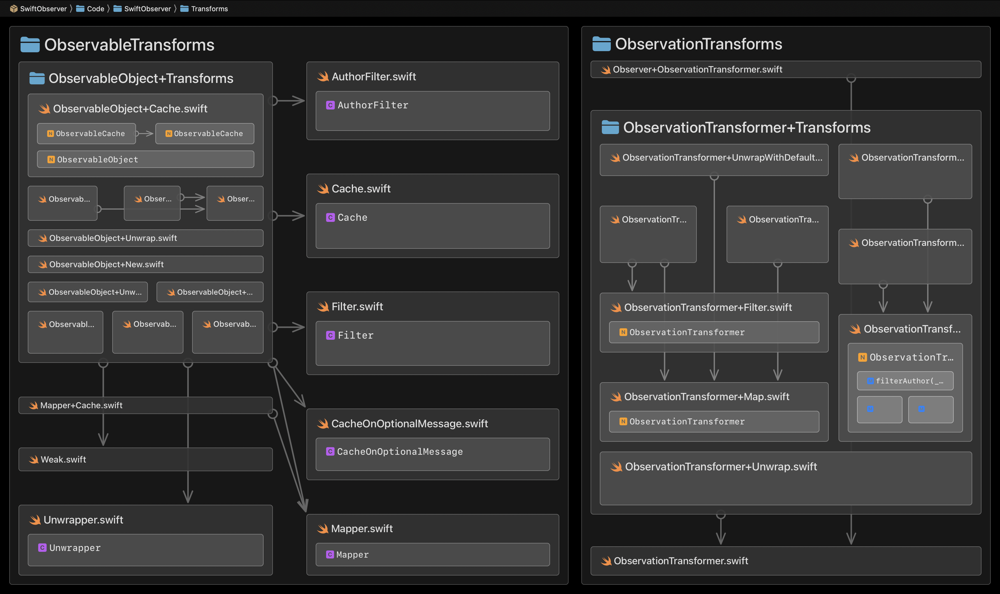
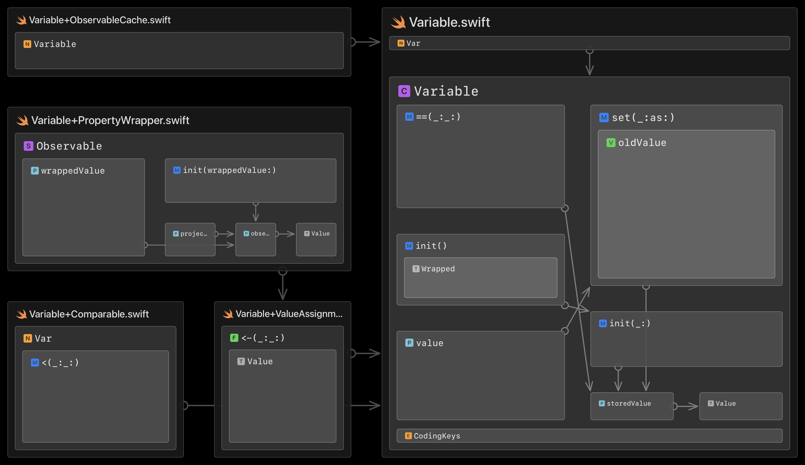
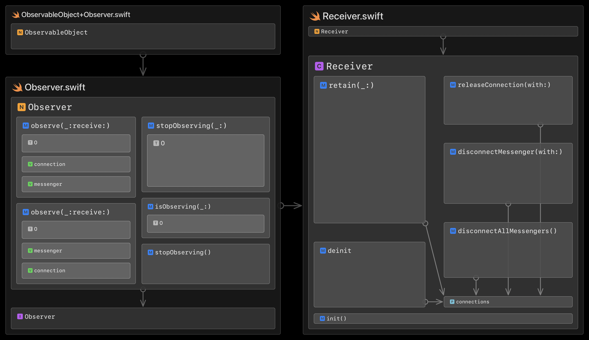
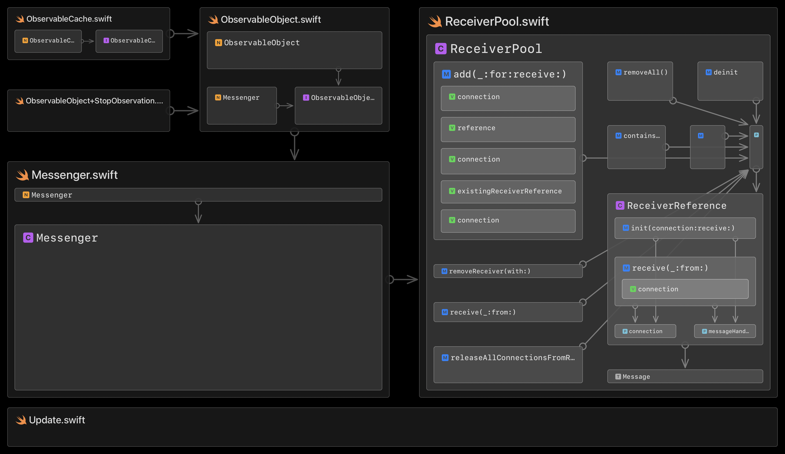

# Architecture

The following diagrams show the internal architecture (composition and dependencies) of all top-level source folders. They were generated with the [Codeface.io](https://www.codeface.io) app:

## SwiftObserver

## Promise

## FreeObserver

## Transforms

## Variable

## Observer

## ObservableObject

