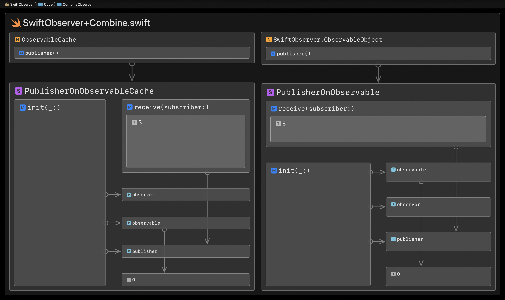

# Architecture

The following diagrams show the internal architecture (composition and dependencies) of all top-level source folders. They were generated with the [Codeface app](https://codeface.io):

## SwiftObserver

## Transforms

## Variable

## Observer

## ObservableObject

## CombineObserver

